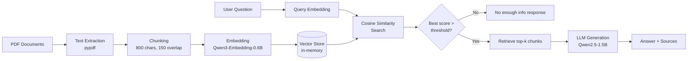

# Local RAG Application with Foundry Local

A fully local, offline Retrieval-Augmented Generation (RAG) course assistant built with Microsoft Foundry Local. It answers Computer Architecture questions (branch prediction, pipelining) by retrieving relevant sections from PDF lecture materials and generating grounded answers with a local LLM - no cloud, no API keys, no internet required after setup.

## Features

- **Fully local & offline** - runs entirely on-device using Foundry Local, zero cloud dependency after initial model download
- **Multi-document support** - automatically loads and indexes every PDF placed in the `documents/` folder
- **Source citation** - every answer reports which document(s) the retrieved context came from
- **Hallucination guard** - if the best similarity score falls below a threshold, the system responds "I don't have enough information" instead of forcing an answer from irrelevant context. This is reinforced by an explicit instruction in the prompt itself
- **One-command startup** - a PowerShell script automatically starts the Foundry Local server, detects its port, loads the required models, and launches the app

## Architecture

## Tech Stack

- **Runtime:** Foundry Local (Microsoft), GPU-accelerated (Intel integrated graphics)
- **Chat model:** Qwen2.5-1.5B-Instruct
- **Embedding model:** Qwen3-Embedding-0.6B
- **PDF parsing:** pypdf
- **Language:** Python 3.13

## Setup

1. Install Foundry Local: `winget install Microsoft.FoundryLocal`
2. Create a virtual environment and install dependencies:
3. Place your PDF(s) in the `documents/` folder
4. Run: `.\start.ps1`

The script automatically starts the Foundry Local server, detects the port it is running on, loads the chat and embedding models, and launches the assistant.

## Usage

Once running, simply type your question, for example: `what is branch prediction`

Type `q` to quit.

## Testing and Evaluation

The system was tested against two categories of questions:

**In-scope questions** (answerable from the PDF documents):
- Questions like "what is branch prediction" and "what is pipelining" consistently returned similarity scores above 0.55 and produced accurate, well-structured answers grounded in the correct source document.

**Out-of-scope questions** (not covered by the documents):
- Irrelevant questions (e.g. general knowledge unrelated to computer architecture) returned similarity scores around 0.3-0.4, below the 0.4 threshold, and the system correctly responded that it did not have enough information rather than fabricating an answer.
- In borderline cases where the similarity score was just above the threshold but the retrieved content was still unrelated to the question, the model itself - following the explicit prompt instruction - also declined to fabricate an answer. This two-layer safeguard (similarity threshold + prompt instruction) makes the system more resistant to hallucination than relying on either mechanism alone.

## Known Limitations

- Runs on an Intel integrated GPU with limited VRAM, which constrained the choice of chat model size (larger models such as Phi-4-mini failed to load due to insufficient GPU memory)
- The similarity threshold (0.4) was calibrated manually against a small number of test questions and may need adjustment for other document sets
- Answer quality and consistency is noticeably better in English than in Turkish, since both the source documents and the underlying model's strongest language are English
- PDF text extraction has minor artifacts (broken ligatures) on some source files, partially mitigated with a manual cleanup step

## Development Journey

This project went through several rounds of real debugging and iteration rather than a single straightforward implementation:

- **SDK/CLI version mismatches:** the initial Python SDK version did not match the installed Foundry Local CLI's command structure, requiring investigation into the correct package version and eventually bypassing the SDK wrapper entirely in favor of calling the OpenAI-compatible REST endpoint directly.
- **Dynamic port handling:** Foundry Local assigns a different local port on each server restart. This was solved by writing a startup script that parses the server's own output to detect the current port automatically.
- **Hardware constraints:** attempting to load a larger model (Phi-4-mini, 2.2GB) failed due to limited GPU memory on the integrated graphics card. This was resolved by selecting a mid-sized model (Qwen2.5-1.5B) that balanced answer quality against available hardware resources.
- **Hallucination handling:** the initial version always answered using the closest retrieved chunk, even for completely unrelated questions. This was fixed by adding a cosine similarity threshold check combined with an explicit "say you don't know" instruction in the prompt.

## Project Context

This project was built as part of the Microsoft Internship Program, exploring Foundry Local for building on-device RAG applications, using real Computer Architecture lecture PDFs (branch prediction, pipelining) as the knowledge base.
